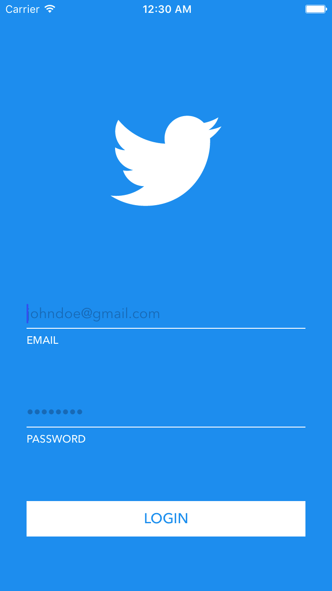

# Basic Twitter Client (iOS)

The app is written in Swift 3 and requires a minimum deployment target of iOS 10. It has not been optimized for iPad.

## Setup
[CocoaPods](http://cocoapods.org) is used as a dependency manager for the application. Before running the application make sure CocoaPods is installed on your machine. You can install/update CocoaPods by running the command `sudo gem install cocoapods` in Terminal. Once CocoaPods is installed navigate to the root directory of the project in Terminal and run `pod install`.

## Features
This is a very basic Twitter client without using the real Twitter API, OAuth, or custom UI controls. There are 3 main screens to the app:
#### 1. Sign Up / Log In
Users can sign up and/or log in using an email and password form. If an account exists with the entered email and password combination, the user will be logged in, otherwise a new user account will be created provided the credentials pass form validation. The email must be a valid email address and the password must be at least 6 characters in length. The user will be logged in automatically on subsequent launches of the app unless they log out.

#### 2. Tweets
Once the user is logged in, the app will display a feed of cached tweets and attempt to load new tweets. Reloading the feed by swiping down on the feed will cause the feed to attempt to fetch newer tweets from the provider. This screen also contains a log out button and a compose (+) button.
#### 3. Compose
On the compose screen, the user can compose a new tweet to post. This content of the tweet is a string between 1 and 140 characters in length. From this screen the user can either cancel or post the tweet. Both cases return the user to the tweets screen. If a new tweet was posted it will be added to the top of the feed.

## Architecture
The application is written using a MVVM (Model-View-ViewModel) pattern and a functional reactive programming library called RxSwift. MVVM

## Tests
#### Unit Tests
#### Integration tests

## Author

Cole Dunsby, coledunsby@gmail.com
