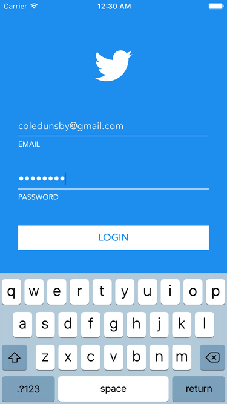
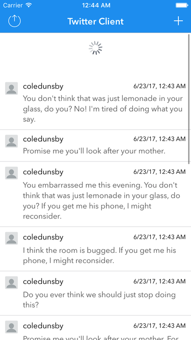
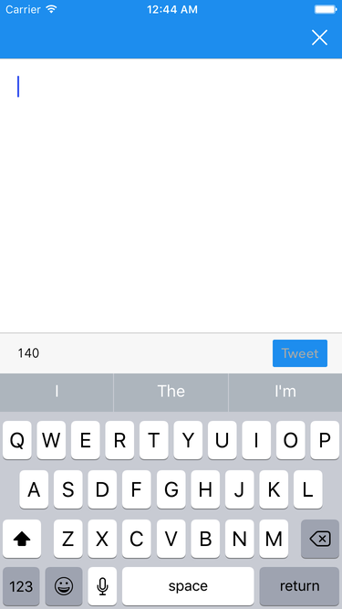
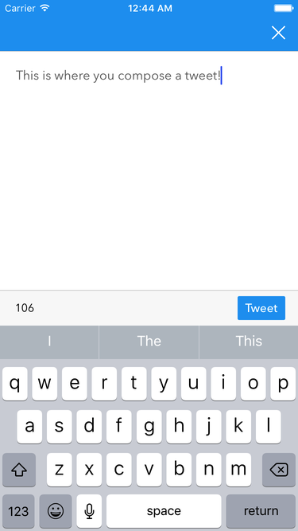

# Basic Twitter Client (iOS)

The app is written in Swift 3 and has a minimum deployment target of iOS 10. It has not been optimized for iPad.

## Setup
[CocoaPods](http://cocoapods.org) is used as a dependency manager for the application. Before running the application make sure CocoaPods is installed on your machine. You can install/update CocoaPods by running the command `sudo gem install cocoapods` in Terminal. Once CocoaPods is installed navigate to the root directory of the project in Terminal and run `pod install`.

## Features
This is a very basic Twitter client implemented without the real Twitter API, OAuth or custom UI controls. There are 3 main screens to the app:
#### 1. Sign Up / Log In
Users can sign up and/or log in using an email and password form. If an account exists with the entered email and password combination, the user will be logged in, otherwise a new user account will be created provided the credentials pass form validation. The email must be a valid email address and the password must be at least 6 characters in length. The user will be logged in automatically on subsequent launches of the app unless they log out.

#### 2. Tweets
Once the user is logged in, the app will display a feed of cached tweets and attempt to load new tweets. Reloading the feed by swiping down to refresh will cause the feed to attempt to fetch newer tweets from the provider. This screen also contains a log out button and a compose (+) button.

#### 3. Compose
On the compose screen, the user can compose a new tweet to post. The content of the tweet is a string between 1 and 140 characters in length. From this screen the user can either cancel or post the tweet. Both cases return the user to the tweets screen. If a new tweet was posted it will be added to the top of the feed.

## Architecture
The application was developed using a MVVM (Model-View-ViewModel) pattern and a functional reactive programming library called RxSwift. I chose to use a reactive library because it helps eliminate state and provides better local reasoning, ultimately leading to cleaner and more maintainable code written faster with fewer bugs. I chose RxSwift in particular because it has similar implementations in many other languages (see [ReactiveX](http://reactivex.io/languages.html) site for more) so it would be ideal for cross platform development. I chose MVVM because the data flow plays nicely with the Rx concepts of observables and observers. There is a 1-1 relationship between view controllers & view models and cells & view models.

I divided the app into 3 main sections:

#### 1. Login
 - `Login.storyboard`: Log in and sign up GUI.
 - `User.swift`: The `User` class represents a user in the Realm database.
 - `LoginViewController.swift`: The view controller binds to the `LoginViewModel` inputs and outputs.
 - `LoginViewModel.swift`: The view model maps the inputs into outputs.
 - `LoginProvider.swift`: Defines a `LoginProviding` protocol that all login providers must conform to. This protocol has an associated type called `Parameter` which defines what the login provider requires as input. I did this because I figured different login providers (e.g. username/password, Facebook, Twitter, etc.) would require different inputs. This way a login provider can have anything as an input (e.g. set of credentials, key, etc.) take while maintaining type safety. This file also contains a type erased `LoginProvider` called `AnyLoginProvider<T>`.
 - `LocalLoginProvider.swift`: Defines a struct `LoginCredentials` to encapsulate an email and password. Contains an implementation of `LoginProviding` with a `Parameter` of `LoginCredentials`.

#### 2. Tweets
 - `Tweets.storyboard`: Tweet feed GUI.
 - `Tweet.swift`: The `Tweet` class represents a tweet in the Realm database.
 - `TweetsViewController.swift`: The view controller binds to the `TweetsViewModel` inputs and outputs.
 - `TweetsViewModel.swift`: The view model maps the inputs into outputs.
 - `TweetCell.swift`: The cell binds to the `TweetCellViewModel` inputs and outputs.
 - `TweetCellViewModel.swift`: The view model maps a `Tweet` into outputs to update the cell UI elements.
 - `TweetProvider.swift`: Defines protocols `TweetFetching`, `TweetPosting` and `TweetProviding` to define the requirements of the various tweet related operations. All protocols require a `User` as input.
 - `LocalTweetProvider.swift`: Contains an implementation of `TweetFetching`, `TweetPosting` and `TweetProviding` using random data.

#### 3. Compose
 - `Compose.storyboard`: Compose GUI.
 - `ComposeViewController.swift`: The view controller binds to the `ComposeViewModel` inputs and outputs.
 - `ComposeViewModel.swift`: The view model maps the inputs into outputs.

## Database

The Cache was implemented using Realm – a relational mobile database. All data flows through the Cache. This means that data providers must update the Cache and the Cache updates the UI. This was done to create a funnel and standardize the way the UI is updated. The implementation of the Cache also uses `NSUserDefaults` to persist a user across app launches and the Keychain to securely store user passwords. The passwords are not stored in plain text in the Realm database. They are stripped upon saving and injected upon retrieval.

There are 2 model objects:

| User             |
| ---------------- |
| email: String    |
| password: String |

| Tweet           |
| --------------- |
| id: String      |
| user: User      |
| message: String |
| date: Date      |

## Dependencies
 1. [KeychainSwift](https://github.com/evgenyneu/keychain-swift): Keychain wrapper to simplify reading from and writing to the Keychain
 2. [Realm](https://github.com/realm/realm-cocoa): Mobile database used for caching
 2. [RxCocoa](https://github.com/ReactiveX/RxSwift/tree/master/RxCocoa): Reactive wrapper for Cocoa
 3. [RxGesture](https://github.com/Coledunsby/RxGesture): Reactive wrapper for view gestures
 4. [RxKeyboard](https://github.com/RxSwiftCommunity/RxKeyboard): Reactive wrapper for keyboard
 5. [RxRealm](https://github.com/RxSwiftCommunity/RxRealm): Reactive wrapper for Realm
 6. [RxRealmDataSources](https://github.com/RxSwiftCommunity/RxRealmDataSources): Reactive extensions for binding Realm data to table and collection views
 7. [RxSwift](https://github.com/ReactiveX/RxSwift): Core functional reactive programming library
 8. [RxSwiftExt](https://github.com/RxSwiftCommunity/RxSwiftExt): Additional operators for RxSwift
 9. [RxTest](https://github.com/ReactiveX/RxSwift/tree/master/RxTest): Testing framework for RxSwift
 10. [SwiftLint](https://github.com/realm/SwiftLint): A tool to enforce Swift style and conventions (runs as a build phase)
 11. [SwiftRandom](https://github.com/thellimist/SwiftRandom): Random data generator

## Tests
#### Unit Tests
I wrote several unit tests for the models (`UserTests`, `TweetTests`, `CacheTests`, `LoginCredentialsTest`, `LocalTweetProviderTests`) to test the various operators that are defined for each.
#### Integration tests
I wrote several integration tests for the view models (`LoginViewModelTests`, `TweetsViewModelTests`, `ComposeViewModelTests`) to test the mapping of the various inputs to the outputs. For these tests I used the `TestScheduler` class in `RxTest` to test observable sequences in virtual time.

## Notes
 - A random delay is added to most data provider actions to simulate a network delay.
 - I did not implement any reachability detection in the app meaning log in and sign up can occur at any time regardless of network connectivity. I figured the data providers would be responsible for returning appropriate errors. I did not include such feedback in my local data providers.
 - A common pattern in my view model outputs was to have an observable for the successful result (e.g. `composeViewModel` in `LoginViewModel`) and an observable for the errors. This was because in `flatMap`ing the inputs to the outputs, if the observable returned in the `flatMap` was to error, the error would not be propagated up the stream. Instead, the sequence would complete and further inputs would have no effect. To circumvent this, I use the `materialize()` function of `RxSwiftExt` to convert the stream into a stream of events. I then use the `elements()` and `errors()` properties to forward the events to the correct streams. Another benefit is that all the errors get propagated to one observable and can be handled together (e.g. in the `TweetsViewModel` both loading newer tweets and logging out can error).

## Author
Cole Dunsby, coledunsby@gmail.com
